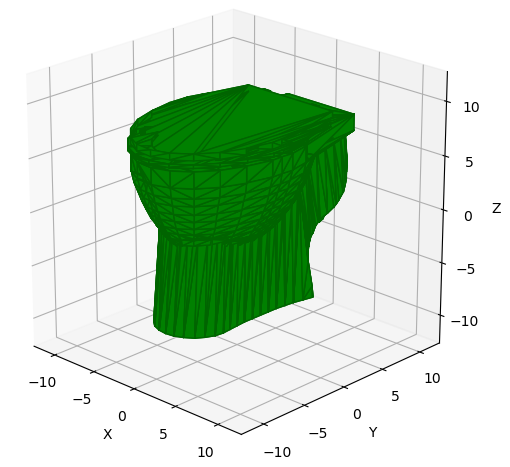

# OFF Parser

[](https://travis-ci.com/mpewsey/off_parser)
[](https://off_parser.readthedocs.io/en/latest/?badge=latest)
[](https://codecov.io/gh/mpewsey/off_parser)

## About
This package provides a class for parsing .OFF (Object File Format) 3D model
files for manipulation of the data using Python. In addition, it provides
helper functions for downloading and parsing data from the below datasets.

| Dataset              | Function          | Source                            |
|----------------------|-------------------|-----------------------------------|
| Princeton ModelNet10 | `load_modelnet10` | [http://modelnet.cs.princeton.edu/](http://modelnet.cs.princeton.edu/) |
| Princeton ModelNet40 | `load_modelnet40` | [http://modelnet.cs.princeton.edu/](http://modelnet.cs.princeton.edu/) |


This package is in no way affiliated with these datasets. For terms of dataset
usage, please consult each datasets respective licensing and conditions.


## Installation

The latest development version of this package may be installed via `pip`:

```
pip install git+https://github.com/mpewsey/off_parser#egg=off_parser
```

## Parsing Files

An .OFF file may be loaded by passing the file path to the class constructor:

```
from off_parser import OffParser
p = OffParser('path/file.off')
```

The points and faces contained in the file can then be accessed via the
`points` and `faces` properties.

The 3D model may also be plotted using `matplotlib` by calling the `plot`
method:

```
p.plot()
```



## Loading Datasets

The functions specified in the table in the [About](#about) section
may be used to load their respective datasets. The first time a function
is called, the dataset will be downloaded to the operating system's temporary
directory. If the download is interrupted or you encounter a problem with
the file, delete the file from the temporary directory and try calling
the function again. The dataset files can take some time to download so
please be patient.
